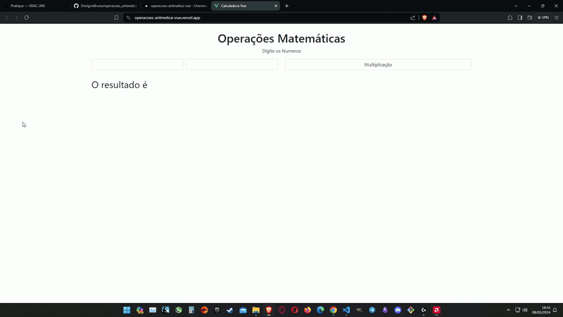

  

# Projeto Operações Aritméticas com VueJS 📝
Projeto Feito como desafio (ou tarefa) do curso da Ebac(Engenheiro Front End).
Projeto focado em conseguir fazer as renderizações em tempo real com os resultados e separar o código em componentes.

# Tecnologias - 👨‍💻
- VueJS
- Bootstrap
- Git
